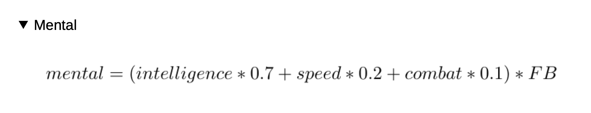

# The Thunderdome

_by Jerónimo Salazar_

## Requirements

* ruby 2.7.3
* bundler

## Run program

To run the program, you need to install the dependencies first:
```bash
bundle install
```

After that, the env variable `SUPER_HERO_TOKEN` has to be set, the easiest way is on execution:
```bash
SUPER_HERO_TOKEN=xxxxxxx ruby main.rb
```
This token can be generated on the **Getting your Access Token** section of the [superheroAPI docs](https://www.superheroapi.com).

All of the programs output and logs can be inspected on the terminal


## Design decisions

The current implementation presents a slight difference with the original problem regarding the calculations for each hero attacks and corrected stats.

After a brief analysis it was brought to attention that the Filiation Coefficient (FB) had way to big of an impact on the stats and attack values of the heroes compared to their health. This happens because each attack is calculated based on the corrected stats of the heroes, which are calculated as such:


So, if we take a look, for example, at the mental attack, we see that it's calculated as a linear combination of said corrected stats, multiplied by FB.



This means that effectively, each attack depends on FB^2, giving a 10^2 times advantage or 10^-2 disadvantage over their enemy depending on their alignment.

This would mean fights that would be over in one single attack (10000 dmg over 150 health) or would drag on for a long time (0.1 dmg attacks over 150 health).

This solutions presents the following 2 revisions:
1. FB is calculated with a random number between 0 and 2, instead of 0 and 9.
2. Each attack calculation is no longer multiplied by FB, so the final values will depend on FB alone (from the corrected stats) instead of FB^2.

Nevertheless, the branch `original-calculations` presents a solution to the problem using the original calculations, in case of them being needed.